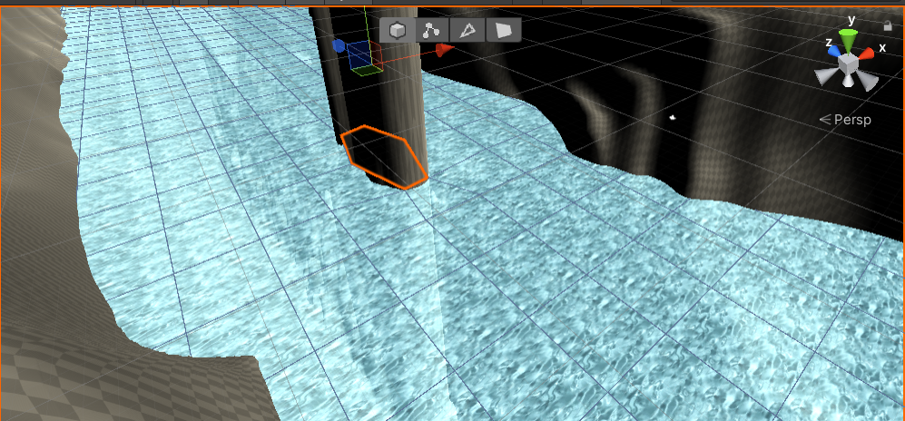

# UVスクロールと半透明

* 川をきれいに流そう
* 光を差し込ませよう

# 拡張した点

-川を流す
-水なので流すだけではなく透過させた

UVのTillingをさげて画像に合わせようとするとUVの頂点が離れてしまう…

ゴッドレイは何回か動画見たけどわからなかったので、理解が追い付いたらやる。
# 進め方

- 本リポジトリをフォークしてください
- フォークしたリポジトリをcloneします
- Unityのプロジェクトを更新して実装してください。
- このテキストファイルに変更点を記載してください
- result.pngを自分の結果を保存して差し替えてください
- プルリクエストを出して提出してください
